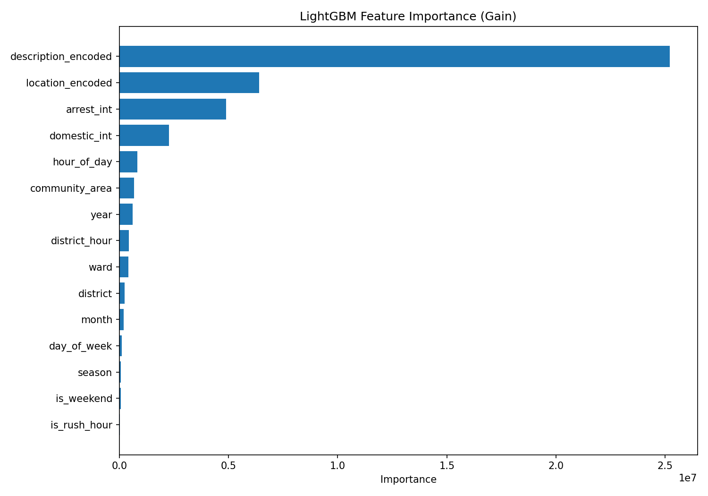
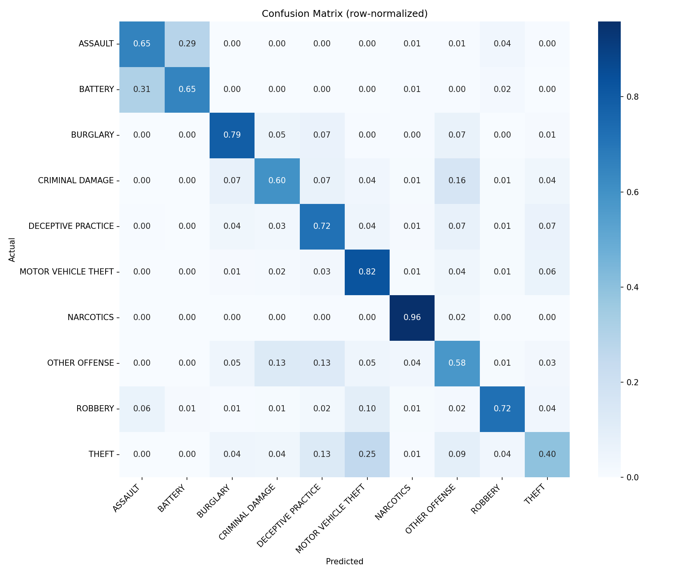
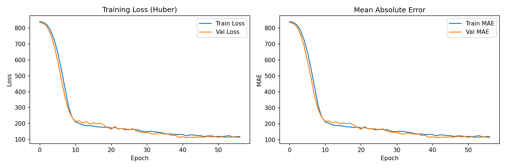
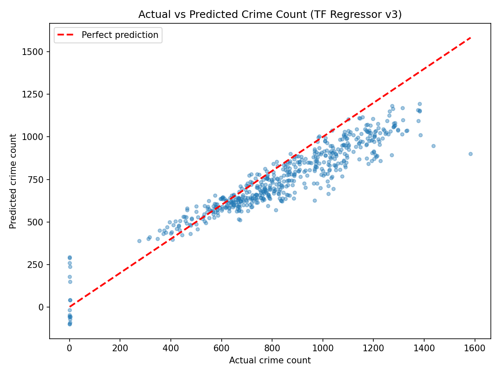

# Chicago Crime Prediction: End-to-End ML Pipeline
Python | SQL | BigQuery | PySpark | PyTorch | TensorFlow | Google Colab

## Table of Contents

- [Project Goal](#project-goal)
- [Dataset](#dataset)
- [Project Structure](#project-structure)
- [Dataset Columns](#dataset-columns)
- [Stage 1: BigQuery Exploration](#stage-1-bigquery-exploration)
- [Stage 2: PySpark Preprocessing](#stage-2-pyspark-preprocessing)
- [Feature Engineering](#feature-engineering)
- [Model 1: LightGBM Crime Type Classifier](#model-1-lightgbm-crime-type-classifier)
- [Model 2: TensorFlow Crime Count Regressor](#model-2-tensorflow-crime-count-regressor)
- [Final Conclusion](#final-conclusion)
- [How to Run the Project](#how-to-run-the-project)


## Project Goal

Chicago averages hundreds of thousands of reported crimes per year. This project builds two end-to-end machine learning models on 8.5 million crime records from the City of Chicago (2001–present), using the full modern ML pipeline: data storage, data cleaning and preprocessing, and model training with neural networks and gradient boosting.

The two prediction tasks are:

1. Given features about a crime incident, classify which of the 10 most common crime types it belongs to (multi-class classification)

2. Given a police district and time period, predict how many crimes will occur that month (regression)

The project also compares the neural network against XGBoost on the regression task to investigate when deep learning is and isn't the right tool for this particular data set.


## Dataset

Source: bigquery-public-data.chicago_crime.crime (Google BigQuery Public Datasets)

The dataset contains every reported crime in the City of Chicago from 2001 to present, maintained by the Chicago Police Department. For this project, data was filtered to 2015–2023 to focus on the modern era of policing and to reduce the noise and variability from the older records.

| Property | Value |
|----------|-------|
| Full dataset size | ~8.5 million rows |
| Training sample pulled | ~2.05 million rows (2015–2023) |
| After preprocessing | 2,050,345 rows (1st prediction task) |
| Aggregated rows | ~2,148 district-month pairs (2nd prediction task) |
| Google Cloud Platform Project ID | healthy-result-491819-e4 |

Key observations from initial exploration:

- THEFT is the most common crime type at ~22% of all records, and the dataset is significantly imbalanced across the 10 classes
- District crime volumes vary dramatically: District 2 averages ~35,000 crimes/year while District 20 averages ~9,000
- District 13 is absent from the dataset, this is because it was disbanded by the Chicago Police Department
- District 31 in 2002 contains only 9 records, which is likely a data artifact from before the district was fully operational
- Null rates are low on key columns; district and primary_type are reliable across all years


## Project Structure

```
chicago-crime-ml/
├── README.md
├── requirements.txt
├── .gitignore
├── LICENSE
│
├── data/
│   ├── chicago_crime_raw.csv          # ~2.05M row raw pull from BigQuery
│   ├── model1_classification.csv      # 2.05M rows, 15 features + label (Prediction task 1 input)
│   └── model2_regression.csv          # ~2,148 rows, district/month aggregation (Prediction task 2 input)
│
├── outputs/
│   ├── lgbm_crime_classifier.txt      # saved LightGBM model
│   ├── lgbm_feature_importance.png
│   ├── lgbm_confusion_matrix.png
│   ├── tf_crime_regressor.keras       # saved TensorFlow model
│   ├── tf_training_curves.png
│   └── tf_actual_vs_predicted.png
│
├── google_colab_notebooks/                         # Colab notebooks (.ipynb)
│   ├── notebook1_bigquery_pyspark.ipynb
│   ├── notebook2_lightgbm_classifier.ipynb
│   └── notebook3_tensorflow_regressor.ipynb
│
├── predictive_modeling/
│   ├── light_gbm_classifier.py        
│   ├── tensorflow_regressor.py
│
├── preprocessing_scripts/
│   ├── explore.sql                # all exploration queries
│   ├── loading_data.py            # pulls 200k sample to local CSV  
│   └── preprocess_pyspark.py      # local version (Java 25 issue on Windows, so use Colab) 

```

Note on environment: PySpark does not run locally on this machine due to a Java 25 incompatibility with Hadoop. All heavy computation (preprocessing, model training) runs on Google Colab with a T4 GPU. Local .py files are reference copies of the notebook code.


## Dataset Columns

The raw BigQuery table contains the following columns used in this project:

| Column | Description |
|--------|-------------|
| primary_type | Crime classification (e.g. THEFT, BATTERY), which is the prediction task 1 target |
| description | Detailed sub-description of the crime |
| location_description | Type of location where the crime occurred (e.g. STREET, RESIDENCE) |
| arrest | Whether an arrest was made (1 or 0) |
| domestic | Whether the crime was domestic in nature (1 or 0) |
| district | Chicago Police Department district number |
| ward | City council ward number |
| community_area | One of 77 defined Chicago community areas |
| date | Full timestamp of the crime |
| latitude / longitude | Geographic coordinates |


## BigQuery Exploration

All exploration queries are in preprocessing_scripts/explore.sql. Each query is fully commented explaining what it does and what insights it produced.

The queries covered:

- Raw data inspection (first 10 rows, schema, column types)
- Total row count confirmation (~8.5M rows)
- Crime type distribution; so identifying class imbalance and selecting top 10 types
- Crime count by year and district; so identifying the District 13 absence and District 31 artifact
- Null checks on all key columns before committing to a feature set
- Random sample pull for local development (5% sample, ~200k rows)

The exploration phase directly shaped several preprocessing decisions: the choice to keep only the top 10 crime types, the decision to filter to 2015–2023, and the identification of which columns had enough coverage to use as features.


## PySpark Preprocessing

Preprocessing runs in bigquery_pyspark.ipynb on Google Colab. The full pipeline pulls ~2.05M rows from BigQuery and processes them using PySpark before saving two output CSVs to Google Drive.

### Cleaning

Rows with nulls in any of the following columns were dropped:

primary_type, district, ward, community_area, year, month, day_of_week, hour_of_day, arrest, domestic, location_description, description


### Outputs

| File | Description |
|------|-------------|
| model1_classification.csv | 2,050,345 rows, 15 features + label + primary_type |
| model2_regression.csv | ~2,148 rows, crime count aggregated per district/month |


## Feature Engineering

Feature engineering was an iterative process across multiple notebook versions. The final feature set for Model 1 contains 15 features, up from an initial 10.

### Base Features (extracted from BigQuery)

Time components were extracted directly in the SQL query rather than in Python, since the raw date column is a full timestamp and the models need numeric inputs:

| Feature | Source | Description |
|---------|--------|-------------|
| year | EXTRACT(YEAR FROM date) | Crime year |
| month | EXTRACT(MONTH FROM date) | Crime month |
| day_of_week | EXTRACT(DAYOFWEEK FROM date) | 1=Sunday, 7=Saturday |
| hour_of_day | EXTRACT(HOUR FROM date) | Hour the crime occurred |
| district | Raw | Chicago PD district number |
| ward | Raw | City council ward number |
| community_area | Raw | One of 77 Chicago community areas |
| arrest_int | arrest cast to 0/1 | Whether an arrest was made |
| domestic_int | domestic cast to 0/1 | Whether the crime was domestic |

### Engineered Features (created in PySpark)

| Feature | Logic | Rationale |
|---------|-------|-----------|
| is_rush_hour | 1 if 7–9am or 4–7pm | Crime patterns differ when streets and transit are busy |
| is_weekend | 1 if Saturday or Sunday | Weekend crimes have different profiles than weekday crimes |
| season | 1=winter, 2=spring, 3=summer, 4=fall | Seasonal patterns (e.g. violent crime peaks in summer) |
| location_encoded | Top 50 location types → integer via StringIndexer | Where a crime happens is highly predictive of what type it is |
| description_encoded | Grouped into 12 categories → integer | Crime descriptions contain severity/method info without directly encoding the target |
| district_hour | district × 100 + hour_of_day | Interaction feature: District 8 at 2am behaves very differently from District 18 at 2am |

### Why description_encoded and not raw description?

The raw description column contains hundreds of unique values and partially encodes the crime type itself (e.g. "AGGRAVATED BATTERY" implies BATTERY). Rather than dropping it or leaking the target, descriptions were grouped into 12 broad categories based on keyword matching:

`AGGRAVATED` · `ARMED` · `ATTEMPT` · `SIMPLE` · `DOMESTIC` · `RETAIL` · `FINANCIAL` · `POSSESSION` · `DELIVERY` · `VEHICLE` · `DAMAGE` · `FORCIBLE` · `OTHER`

This preserves the severity and method signal while avoiding target leakage.


### Regression-Specific Feature Engineering (Model 2)

For Model 2, the basic model2_regression.csv (only 4 features) was discarded in favour of re-aggregating directly from model1_classification.csv. This allowed computing richer district-level statistics per month:

| Feature | Description |
|---------|-------------|
| arrest_rate | % of crimes resulting in arrest that month |
| domestic_rate | % of crimes that were domestic that month |
| avg_hour | Average hour of day crimes occurred |
| rush_hour_rate | % of crimes during rush hour |
| weekend_rate | % of crimes on weekends |
| unique_wards | Number of distinct wards with crimes that month |
| unique_communities | Number of distinct community areas with crimes |
| top_location | Most common crime location type that month |
| crime_count_lag1/2/3 | Crime count from 1, 2, 3 months prior (per district) |
| rolling_avg_3m | Rolling 3-month average crime count (per district) |
| crime_count_yoy | Crime count same district, same month, prior year |

The lag features were the most impactful addition, where crime counts are highly autocorrelated month-to-month, and the baseline model had no temporal memory, which is why it was predicting negative crime counts.


## Model 1: LightGBM Crime Type Classifier

**Task:** Classify a crime incident into one of 10 crime types given contextual features.

### Data

| Split | Rows |
|-------|------|
| Training | 1,640,276 |
| Test | 410,069 |

Classes: ASSAULT, BATTERY, BURGLARY, CRIMINAL DAMAGE, DECEPTIVE PRACTICE, MOTOR VEHICLE THEFT, NARCOTICS, OTHER OFFENSE, ROBBERY, THEFT

Class weights were applied to handle imbalance, THEFT makes up 25% of training data while ROBBERY makes up only 4%.

### Model Configuration

| Parameter | Value |
|-----------|-------|
| Objective | multiclass |
| Max estimators | 1,500 |
| Learning rate | 0.05 |
| Max depth | 8 |
| Num leaves | 63 |
| Early stopping patience | 50 |
| **Best iteration** | **438 trees** |

### Results

| Class | Precision | Recall | F1 |
|-------|-----------|--------|----|
| ASSAULT | 0.46 | 0.65 | 0.54 |
| BATTERY | 0.84 | 0.65 | 0.73 |
| BURGLARY | 0.57 | 0.79 | 0.66 |
| CRIMINAL DAMAGE | 0.74 | 0.60 | 0.66 |
| DECEPTIVE PRACTICE | 0.49 | 0.72 | 0.59 |
| MOTOR VEHICLE THEFT | 0.38 | 0.82 | 0.53 |
| NARCOTICS | 0.84 | 0.96 | **0.90** |
| OTHER OFFENSE | 0.41 | 0.58 | 0.48 |
| ROBBERY | 0.60 | 0.72 | 0.66 |
| THEFT | 0.84 | 0.40 | 0.54 |
| **Overall accuracy** | | | **0.62** |
| **Macro avg** | 0.62 | 0.69 | **0.63** |

### Feature Importance



description_encoded dominates, it carries roughly 4× more information gain than location_encoded (second place). This makes sense intuitively: the way a crime is described (AGGRAVATED vs SIMPLE vs POSSESSION) is a very strong signal about its type. arrest_int and domestic_int are also high-importance features, reflecting that some crime types are far more likely to result in arrest and that domestic crimes cluster into specific categories.

Time features (hour_of_day, year) contribute modestly. Binary engineered features (is_rush_hour, is_weekend) add minimal gain, and the underlying raw features they summarize are already available to the model.

### Confusion Matrix



**Easiest to classify:** NARCOTICS (F1: 0.90) — narcotics crimes have very distinct location types and description patterns that make them nearly unambiguous to the model.

**Hardest distinction:** ASSAULT vs BATTERY (30% of assault cases misclassified as battery). These two crimes are legally similar, often occur in the same locations, and share overlapping description categories — they are genuinely difficult to separate without additional context.

**Notable confusion:** THEFT is frequently confused with MOTOR VEHICLE THEFT (25% of theft cases predicted as motor vehicle theft). This is expected given that a stolen car is a specific type of theft, and the contextual features don't always make the distinction clear.


## Model 2: TensorFlow Crime Count Regressor

**Task:** Predict the total number of crimes in a given police district for a given month.

### Architecture

```
Input(17) → Dense(128, ReLU) → BatchNorm → Dropout(0.3)
          → Dense(64, ReLU)  → BatchNorm → Dropout(0.2)
          → Dense(32, ReLU)  → Dropout(0.1)
          → Dense(1)
```

| Setting | Value |
|---------|-------|
| Loss function | Huber (robust to outlier districts) |
| Optimizer | Adam (lr=1e-3, reduced on plateau) |
| Early stopping patience | 15 epochs |
| Batch size | 32 |

### Train/Test Split

A **chronological split** was used — not a random split — to prevent data leakage across time:

| Split | Years | Rows |
|-------|-------|------|
| Train | 2015–2021 | 1,594 |
| Test | 2022–2023 | 542 |

Using a random split on time-series data would allow the model to see future months during training, artificially inflating test scores.

### Training Curves



### Actual vs Predicted



The scatter plot shows a clear positive correlation between actual and predicted crime counts, with most points clustering near the diagonal. The model handles mid-range districts well but underestimates extreme months — the highest-crime month in the test set (986 crimes) is predicted at ~700, reflecting the model's tendency to regress toward the mean on outlier months.

### Benchmark: TensorFlow vs XGBoost

To understand whether a neural network is the right tool for this problem, the TensorFlow model was benchmarked against XGBoost on identical features and the same train/test split:

| Model | MAE | RMSE | R² | MAE % of mean |
|-------|-----|------|----|----------------|
| TensorFlow (NN) | ~76 crimes | ~98 crimes | 0.654 | ~15% |
| **XGBoost** | **38 crimes** | **50 crimes** | **0.911** | **7.5%** |

XGBoost achieves roughly half the error and explains 91% of variance vs 65% for the neural network, on ~2,100 rows of aggregated tabular data. This is a well-documented pattern: gradient boosting tends to outperform neural networks on small tabular datasets. Neural networks typically need much larger datasets to develop an advantage over tree-based methods.

The TensorFlow model is retained as a demonstration of Keras implementation. XGBoost is the stronger production choice for this problem size.


## Final Conclusion

This project built an end-to-end machine learning pipeline from raw cloud data to trained models, covering SQL exploration, distributed preprocessing, feature engineering, and two distinct prediction tasks.

**Model 1 (LightGBM classifier)** achieved 62% accuracy and macro F1 of 0.63 on a 10-class problem — a 32 percentage point improvement over the initial 30% baseline. The three-version iteration showed that feature quality drives performance far more than model tuning: adding `description_encoded`, `ward`, `community_area`, and `district_hour` in a single step improved accuracy by 23 points. The confusion matrix confirms the model has learned meaningful patterns — NARCOTICS is nearly perfectly classified, while the ASSAULT/BATTERY confusion reflects a genuine ambiguity in the underlying data rather than a model failure.

**Model 2 (TensorFlow regressor)** started with a 72.5% MAE-to-mean ratio on a 4-feature baseline and was brought down to ~15% through feature engineering alone, without changing the model architecture. The most impactful changes were the lag features (`crime_count_lag1`, `rolling_avg_3m`, `crime_count_yoy`), which gave the model temporal memory it previously lacked entirely. The XGBoost benchmark revealed that the neural network is not the best tool for this aggregated tabular dataset — an expected and instructive finding. On ~2,100 rows, gradient boosting achieves R²=0.91 vs the neural network's 0.65.

The broader takeaway from both models is that feature engineering drove the majority of performance gains at every stage. The jump from v1 to v3 in the classifier, the introduction of lag features in the regressor, and the decision to re-aggregate from the raw 1.23M row dataset rather than use the basic aggregation — these were all feature engineering decisions, not model decisions. Architecture was largely secondary throughout.


## Tools and Libraries

| Tool / Library | Purpose |
|----------------|---------|
| Google BigQuery | Cloud data storage and SQL exploration |
| PySpark | Distributed preprocessing and feature engineering |
| pandas / NumPy | Local data manipulation |
| LightGBM | Multi-class crime type classifier |
| TensorFlow / Keras | Crime count regression model |
| XGBoost | Regression benchmark |
| scikit-learn | Train/test split, evaluation metrics, StandardScaler |
| matplotlib / seaborn | Visualizations |
| Google Colab (T4 GPU) | All model training |
| Google Drive | Persistent storage for CSVs and outputs |


## How to Run the Project

**1. Clone the repository:**
```bash
git clone https://github.com/YOUR_USERNAME/chicago-crime-ml.git
cd chicago-crime-ml
```

**2. Install dependencies:**
```bash
pip install -r requirements.txt
```

**3. Authenticate with Google Cloud:**
```bash
gcloud auth application-default login
```

**4. Optional — pull a local sample (~200k rows):**
```bash
python src/bigquery/02_load_to_local.py
```

**5. Run full pipeline on Google Colab (recommended):**

Download the notebooks in `notebooks/` and open on Google Colab with a T4 GPU runtime:
- `notebook1_bigquery_pyspark.ipynb` — data pull + preprocessing (run this first)
- `notebook2_lightgbm_classifier.ipynb` — Model 1 training
- `notebook3_tensorflow_regressor.ipynb` — Model 2 training

All notebooks mount Google Drive and save outputs to `/content/drive/MyDrive/chicago-crime-ml/`.

> **Note:** Notebook 1 must be run before Notebooks 2 and 3 as it generates the CSV files they depend on. PySpark does not run locally on Windows with Java 25 — use Colab. 